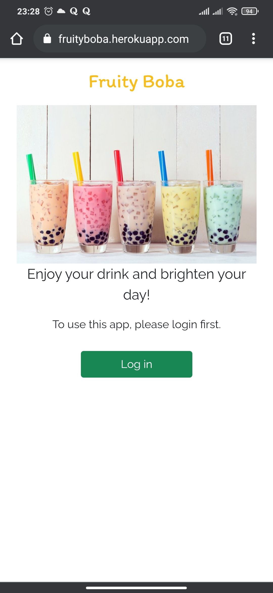
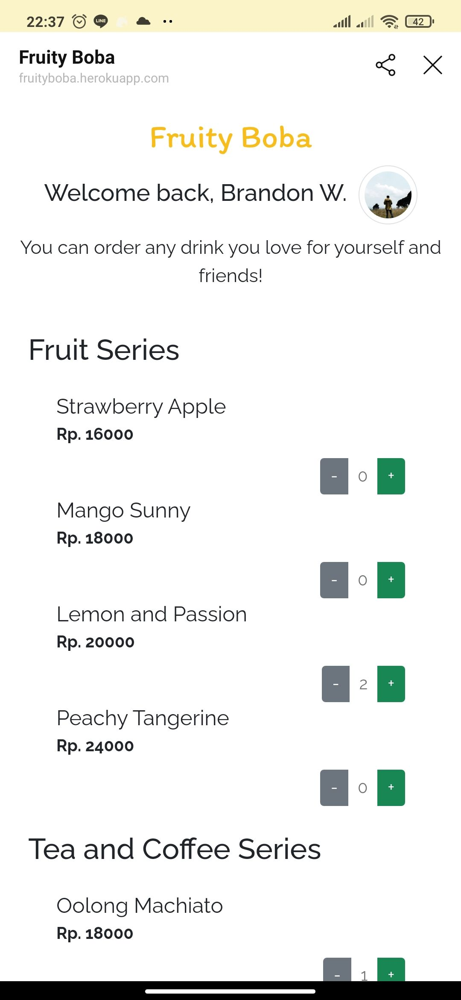
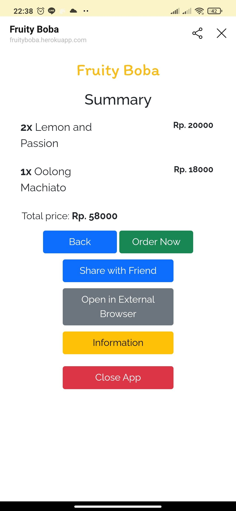
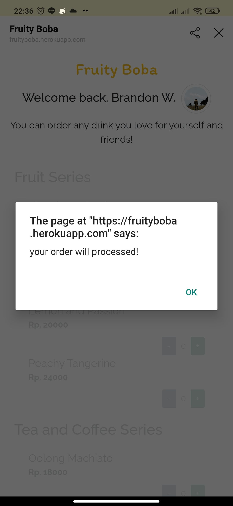
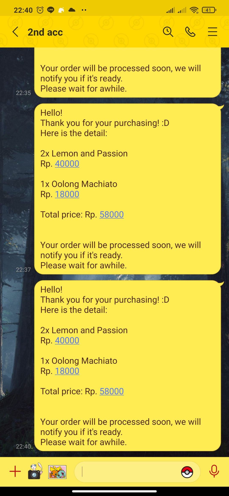
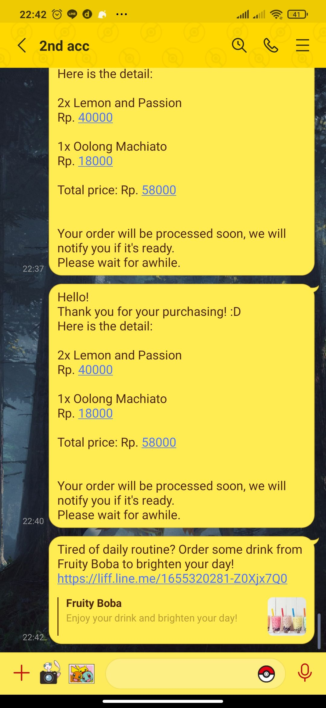

# Fruity Boba
Fruity Boba is a fictional bubble tea store app that is run on top of Line Frontend Framework

You can access it from [here](https://fruityboba.herokuapp.com/)
### Note: To use this app you need to have a LINE account.

## How to use:
1. Login first with your LINE account. (Only if you open it on the external browser)

   

2. Order some drinks from the menu page.

   

3. Check your order and then checkout. You will get an alert if the order is in process.

   &nbsp;&nbsp;
   

4. You will get your order detail sent to the current chat. (Only works if you use LINE in-app browser)

   

## Share to your friend
You can share this app with your friend by picking one of your contacts and the app will send a message with the link.

